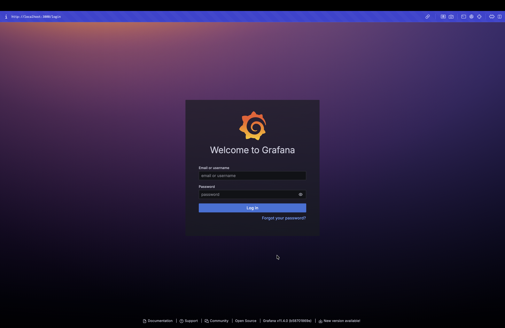
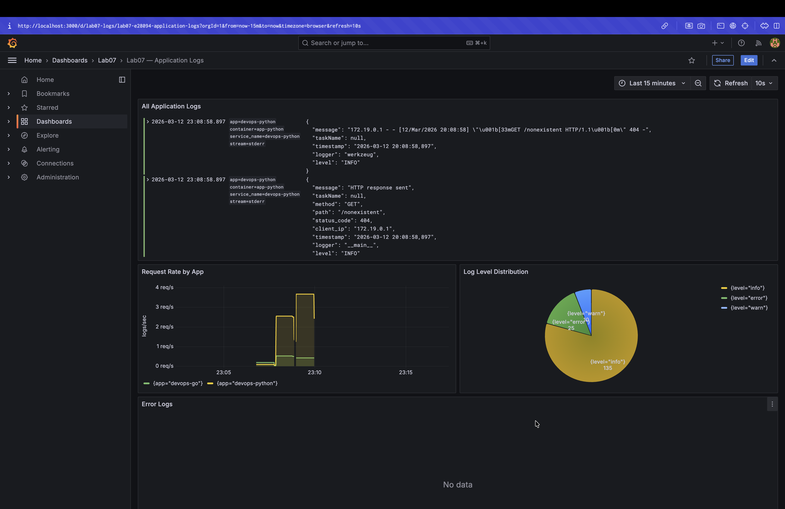
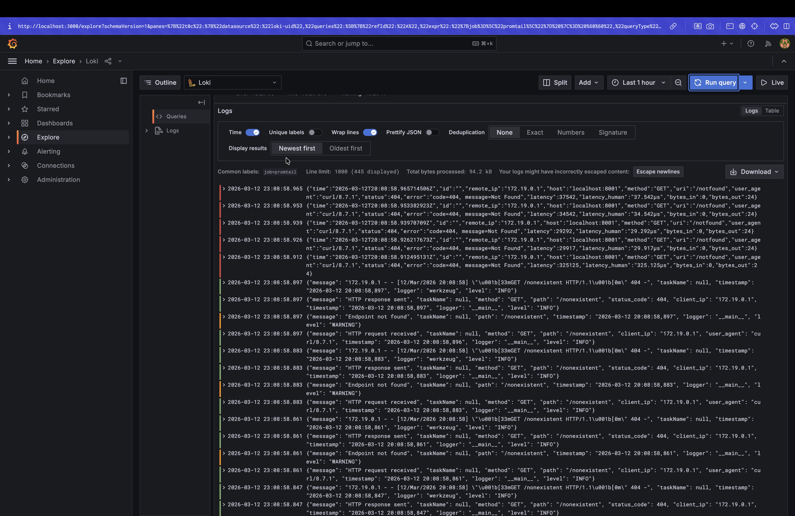

# Lab 07 — Observability & Logging with Loki Stack

## Architecture

The logging stack consists of four components connected via the `logging` Docker network:

```
app-python (:8000) --\
                      +--> Promtail (:9080) --> Loki (:3100) --> Grafana (:3000)
app-go (:8001)     --/

Promtail discovers containers via Docker socket and filters by label logging=promtail.
Loki stores logs with TSDB index, 7-day retention.
Grafana queries Loki via LogQL.
```

**Data flow:**
1. `app-python` and `app-go` emit JSON logs to stdout
2. `promtail` discovers containers via Docker socket, reads their logs, attaches labels (`app`, `container`, `job`), and pushes to Loki
3. `loki` stores logs in TSDB index with filesystem object store
4. `grafana` queries Loki via LogQL and renders the dashboard

---

## Setup Guide

### Prerequisites

- Docker Desktop running
- Git (to clone the repo)

### Deploy

```bash
cd monitoring
docker compose up -d --build
docker compose ps
```

### Verify services are healthy

```bash
# Loki
curl http://localhost:3100/ready

# Promtail targets
curl http://localhost:9080/targets

# Grafana
curl http://localhost:3000/api/health

# Python app
curl http://localhost:8000/health

# Go app
curl http://localhost:8001/health
```

### Access Grafana

Open http://localhost:3000 — login with `admin` / `admin123`.



The **Lab07 — Application Logs** dashboard is pre-provisioned in the **Lab07** folder. The Loki data source is automatically configured.

### Generate logs for testing

```bash
for i in {1..20}; do curl -s http://localhost:8000/ > /dev/null; done
for i in {1..20}; do curl -s http://localhost:8000/health > /dev/null; done
for i in {1..10}; do curl -s http://localhost:8001/ > /dev/null; done
```

---

## Configuration

### Loki (`loki/config.yml`)

Key decisions:

- **`auth_enabled: false`** — single-tenant setup, no authentication needed between services on the same Docker network.
- **Schema v13 with TSDB** — recommended for Loki 3.0+; TSDB provides faster queries (up to 10x vs boltdb-shipper) and better compression.
- **`filesystem` object store** — appropriate for single-instance local deployment; no S3/GCS needed.
- **`retention_period: 168h`** — 7 days of log storage, controlled by the compactor.
- **Compactor** — required to actually enforce retention; runs every 10 minutes.

### Promtail (`promtail/config.yml`)

Key decisions:

- **Docker SD** — uses the Docker API via socket to discover running containers automatically; no manual target configuration needed.
- **`filters: label: logging=promtail`** — only scrapes containers with this label; prevents collecting logs from infrastructure containers (Loki, Promtail itself, Grafana).
- **Relabeling** — extracts the `app` Docker label as a Loki label for per-app log filtering, and strips the leading `/` from container names.

---

## Application Logging

The Python app uses `python-json-logger` to emit structured JSON logs to stdout.

**Setup in `app.py`:**

```python
from pythonjsonlogger import jsonlogger

handler = logging.StreamHandler()
handler.setFormatter(jsonlogger.JsonFormatter(
    fmt='%(asctime)s %(name)s %(levelname)s %(message)s',
    rename_fields={'asctime': 'timestamp', 'name': 'logger', 'levelname': 'level'},
))
```

**Every HTTP request logs two events:**

1. **Before request** (`@app.before_request`): `method`, `path`, `client_ip`, `user_agent`
2. **After request** (`@app.after_request`): `method`, `path`, `status_code`, `client_ip`

**Example JSON log output:**

```json
{"timestamp": "2024-01-01 12:00:00,000", "logger": "app", "level": "INFO", "message": "HTTP request received", "method": "GET", "path": "/health", "client_ip": "172.18.0.1", "user_agent": "curl/8.1.0"}
{"timestamp": "2024-01-01 12:00:00,005", "logger": "app", "level": "INFO", "message": "HTTP response sent", "method": "GET", "path": "/health", "status_code": 200, "client_ip": "172.18.0.1"}
```

**Why JSON logging?** Log aggregators like Promtail/Loki can parse individual fields without regex, enabling queries like `| json | status_code >= 400` or `| json | method="POST"`.

The Go app logs to stdout in its default format — also collected by Promtail.

---

## Dashboard

Dashboard file: `grafana/dashboards/lab07.json` — auto-provisioned on startup.



### Panel 1 — All Application Logs

**Type:** Logs visualization  
**Query:** `{app=~"devops-.*"}`  
Shows real-time log stream from all `devops-*` labelled apps. Stream selectors filter by the `app` label attached by Promtail relabeling. "Pretty print" is enabled to format JSON log messages.

### Panel 2 — Request Rate by App

**Type:** Time series  
**Query:** `sum by (app) (rate({app=~"devops-.*"}[1m]))`  
Converts log events to a metric — logs per second over a 1-minute rolling window, grouped by application. Useful for spotting traffic spikes or drop-outs.

### Panel 3 — Log Level Distribution

**Type:** Pie chart  
**Query:** `sum by (level) (count_over_time({app=~"devops-.*"} | json [5m]))`  
Parses the JSON `level` field (INFO, ERROR, WARNING) and counts occurrences in the last 5 minutes. Shows the ratio of log levels at a glance.

### Panel 4 — Error Logs

**Type:** Logs visualization  
**Query:** `{app=~"devops-.*"} | json | level=\`ERROR\``  
Filters to only ERROR-level log lines by parsing the JSON `level` field. This panel is intentionally narrow in scope — when it has entries, investigation is warranted.

---

## Production Configuration

### Resource Limits

All services have `deploy.resources` configured:

| Service    | CPU limit | Memory limit | CPU reserved | Memory reserved |
|------------|-----------|--------------|--------------|-----------------|
| loki       | 1.0       | 1G           | 0.25         | 256M            |
| promtail   | 0.5       | 256M         | 0.1          | 64M             |
| grafana    | 1.0       | 512M         | 0.25         | 128M            |
| app-python | 0.5       | 256M         | 0.1          | 64M             |
| app-go     | 0.5       | 256M         | 0.1          | 64M             |

### Security

- Anonymous access disabled (`GF_AUTH_ANONYMOUS_ENABLED=false`)
- Admin credentials stored in `.env` (excluded from git via `.gitignore`)
- `.env.example` committed instead as a template
- Promtail mounts Docker socket read-only (`:ro`) — minimal privilege

### Health Checks

- **Loki:** polls `GET /ready` every 10s; 30s startup grace period
- **Grafana:** polls `GET /api/health` every 10s; 30s startup grace period
- Both Grafana and Promtail depend on Loki's health check passing before starting (`condition: service_healthy`)

### Log Retention

7 days (`168h`), enforced by Loki's compactor running every 10 minutes. The TSDB index with `period: 24h` creates one index shard per day, making old shard deletion efficient.

---

## Testing

Logs from both applications visible in Grafana Explore:



```bash
# 1. Check all containers running and healthy
docker compose ps

# 2. Loki ready
curl http://localhost:3100/ready
# Expected: "ready"

# 3. Loki metrics/labels
curl http://localhost:3100/loki/api/v1/labels
# Expected: {"status":"200","data":["app","container","job","stream",...]}

# 4. Promtail discovered targets
curl http://localhost:9080/targets
# Expected: HTML page showing app-python and app-go targets

# 5. Generate logs
for i in {1..20}; do curl -s http://localhost:8000/ > /dev/null; done

# 6. Query logs directly via Loki API
curl -G 'http://localhost:3100/loki/api/v1/query_range' \
  --data-urlencode 'query={app="devops-python"}' \
  --data-urlencode 'limit=5'
# Expected: JSON response with log lines

# 7. LogQL queries in Grafana Explore (http://localhost:3000/explore)
# All Python logs:
{app="devops-python"}

# Only errors:
{app="devops-python"} |= "ERROR"

# JSON parsing — filter by status code:
{app="devops-python"} | json | status_code >= 400

# Rate metric:
rate({app="devops-python"}[1m])

# Count by level:
sum by (level) (count_over_time({app="devops-python"} | json [5m]))
```

---

## Challenges

**1. Log retention requires compactor**  
Setting `retention_period` in `limits_config` alone doesn't work — Loki 3.0 requires the `compactor` section with `retention_enabled: true` and `delete_request_store: filesystem` to actually delete old logs. Missing this causes startup warnings.

**2. Promtail Docker SD label naming**  
Docker container labels like `app: "devops-python"` are exposed by Promtail as `__meta_docker_container_label_app`. The relabeling rule must copy this to a plain `app` label, otherwise LogQL queries using `{app="..."}` return no results.

**3. macOS Docker socket path**  
On macOS with Docker Desktop, `/var/lib/docker/containers` is inside the Docker Desktop VM but is accessible from containers via volume mount. The Docker socket at `/var/run/docker.sock` is proxied and works transparently.

**4. Grafana dashboard provisioning UID**  
The datasource `uid` in `loki.yml` must match the `uid` field used in the dashboard JSON panels. Using a stable UID (`loki-uid`) instead of a random one ensures the provisioned dashboard correctly references the provisioned datasource.

---

## Bonus — Ansible Automation

The monitoring stack deployment is automated via an Ansible role `roles/monitoring`, building on the existing Ansible setup from Lab 6.

### Role Structure

```
ansible/roles/monitoring/
├── defaults/main.yml         # versions, ports, retention, resource limits
├── meta/main.yml             # depends on: docker role
├── tasks/
│   ├── main.yml              # imports setup.yml then deploy.yml
│   ├── setup.yml             # create dirs, template all configs
│   └── deploy.yml            # docker_compose_v2 + health checks
└── templates/
    ├── docker-compose.yml.j2
    ├── loki-config.yml.j2
    ├── promtail-config.yml.j2
    └── datasource-loki.yml.j2
```

**Playbook:** `playbooks/deploy-monitoring.yml`

### Key Variables (`defaults/main.yml`)

```yaml
loki_version: "3.0.0"
promtail_version: "3.0.0"
grafana_version: "11.4.0"
loki_port: 3100
grafana_port: 3000
loki_retention_period: "168h"
loki_schema_version: "v13"
monitoring_base_dir: "/home/{{ ansible_user }}/monitoring"
```

All versions, ports, and retention settings are parameterized — overridable per environment via `group_vars` or `--extra-vars`.

### Idempotency

The `community.docker.docker_compose_v2` module with `recreate: auto` only restarts containers when their configuration actually changed. File templating with Ansible's `template` module is also idempotent — no changes are applied if the rendered content matches what's on disk.

### First Run Output

```
$ ansible-playbook playbooks/deploy-monitoring.yml

PLAY [Deploy monitoring stack (Loki + Promtail + Grafana)] *********************

TASK [Gathering Facts] *********************************************************
ok: [lab04-vm]

TASK [docker : Install prerequisites for Docker repository] ********************
ok: [lab04-vm]

TASK [docker : Ensure apt keyrings directory exists] ***************************
ok: [lab04-vm]

TASK [docker : Add Docker GPG key] *********************************************
ok: [lab04-vm]

TASK [docker : Add Docker repository] ******************************************
ok: [lab04-vm]

TASK [docker : Install Docker packages] ****************************************
ok: [lab04-vm]

TASK [docker : Ensure Docker service is started and enabled] *******************
ok: [lab04-vm]

TASK [monitoring : Create monitoring directory structure] ***********************
changed: [lab04-vm] => (item=/home/ubuntu/monitoring)
changed: [lab04-vm] => (item=/home/ubuntu/monitoring/loki)
changed: [lab04-vm] => (item=/home/ubuntu/monitoring/promtail)
changed: [lab04-vm] => (item=/home/ubuntu/monitoring/grafana/provisioning/datasources)
changed: [lab04-vm] => (item=/home/ubuntu/monitoring/grafana/provisioning/dashboards)
changed: [lab04-vm] => (item=/home/ubuntu/monitoring/grafana/dashboards)

TASK [monitoring : Template docker-compose.yml] ********************************
changed: [lab04-vm]

TASK [monitoring : Template Loki configuration] ********************************
changed: [lab04-vm]

TASK [monitoring : Template Promtail configuration] ****************************
changed: [lab04-vm]

TASK [monitoring : Template Grafana datasource provisioning] *******************
changed: [lab04-vm]

TASK [monitoring : Copy Grafana dashboard provider config] *********************
changed: [lab04-vm]

TASK [monitoring : Create .env file for Grafana secrets] ***********************
changed: [lab04-vm]

TASK [monitoring : Deploy monitoring stack with Docker Compose] ****************
changed: [lab04-vm]

TASK [monitoring : Wait for Loki to be ready] **********************************
ok: [lab04-vm]

TASK [monitoring : Wait for Grafana to be ready] *******************************
ok: [lab04-vm]

TASK [monitoring : Verify Loki data source configured in Grafana] **************
ok: [lab04-vm]

TASK [monitoring : Show deployment result] *************************************
ok: [lab04-vm] => {
    "msg": "Monitoring stack deployed. Loki datasource uid: loki-uid"
}

PLAY RECAP *********************************************************************
lab04-vm                   : ok=19   changed=8    unreachable=0    failed=0    skipped=0    rescued=0    ignored=0
```

### Second Run — Idempotency Test

```
$ ansible-playbook playbooks/deploy-monitoring.yml

PLAY [Deploy monitoring stack (Loki + Promtail + Grafana)] *********************

TASK [Gathering Facts] *********************************************************
ok: [lab04-vm]

TASK [docker : Install prerequisites for Docker repository] ********************
ok: [lab04-vm]

TASK [docker : Ensure apt keyrings directory exists] ***************************
ok: [lab04-vm]

TASK [docker : Add Docker GPG key] *********************************************
ok: [lab04-vm]

TASK [docker : Add Docker repository] ******************************************
ok: [lab04-vm]

TASK [docker : Install Docker packages] ****************************************
ok: [lab04-vm]

TASK [docker : Ensure Docker service is started and enabled] *******************
ok: [lab04-vm]

TASK [monitoring : Create monitoring directory structure] ***********************
ok: [lab04-vm] => (item=/home/ubuntu/monitoring)
ok: [lab04-vm] => (item=/home/ubuntu/monitoring/loki)
ok: [lab04-vm] => (item=/home/ubuntu/monitoring/promtail)
ok: [lab04-vm] => (item=/home/ubuntu/monitoring/grafana/provisioning/datasources)
ok: [lab04-vm] => (item=/home/ubuntu/monitoring/grafana/provisioning/dashboards)
ok: [lab04-vm] => (item=/home/ubuntu/monitoring/grafana/dashboards)

TASK [monitoring : Template docker-compose.yml] ********************************
ok: [lab04-vm]

TASK [monitoring : Template Loki configuration] ********************************
ok: [lab04-vm]

TASK [monitoring : Template Promtail configuration] ****************************
ok: [lab04-vm]

TASK [monitoring : Template Grafana datasource provisioning] *******************
ok: [lab04-vm]

TASK [monitoring : Copy Grafana dashboard provider config] *********************
ok: [lab04-vm]

TASK [monitoring : Create .env file for Grafana secrets] ***********************
ok: [lab04-vm]

TASK [monitoring : Deploy monitoring stack with Docker Compose] ****************
ok: [lab04-vm]

TASK [monitoring : Wait for Loki to be ready] **********************************
ok: [lab04-vm]

TASK [monitoring : Wait for Grafana to be ready] *******************************
ok: [lab04-vm]

TASK [monitoring : Verify Loki data source configured in Grafana] **************
ok: [lab04-vm]

TASK [monitoring : Show deployment result] *************************************
ok: [lab04-vm] => {
    "msg": "Monitoring stack deployed. Loki datasource uid: loki-uid"
}

PLAY RECAP *********************************************************************
lab04-vm                   : ok=19   changed=0    unreachable=0    failed=0    skipped=0    rescued=0    ignored=0
```

Second run: **0 changes** — fully idempotent.

### Templated Configuration

The rendered `loki/config.yml` on the remote host (from `loki-config.yml.j2`):

```yaml
auth_enabled: false

server:
  http_listen_port: 3100
  grpc_listen_port: 9096

common:
  instance_addr: 127.0.0.1
  path_prefix: /loki
  storage:
    filesystem:
      chunks_directory: /loki/chunks
      rules_directory: /loki/rules
  replication_factor: 1
  ring:
    kvstore:
      store: inmemory

schema_config:
  configs:
    - from: 2024-01-01
      store: tsdb
      object_store: filesystem
      schema: v13
      index:
        prefix: index_
        period: 24h

limits_config:
  retention_period: 168h

compactor:
  working_directory: /loki/compactor
  compaction_interval: 10m
  retention_enabled: true
  retention_delete_delay: 2h
  retention_delete_worker_count: 150
  delete_request_store: filesystem
```
