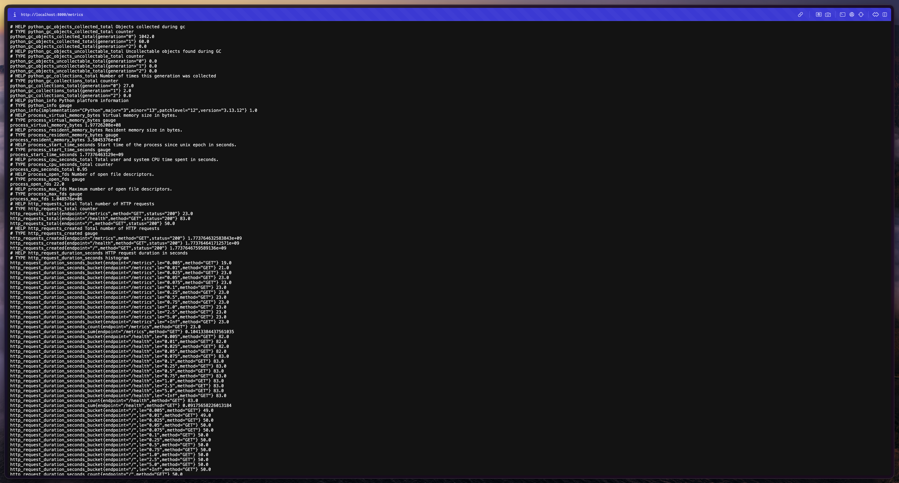
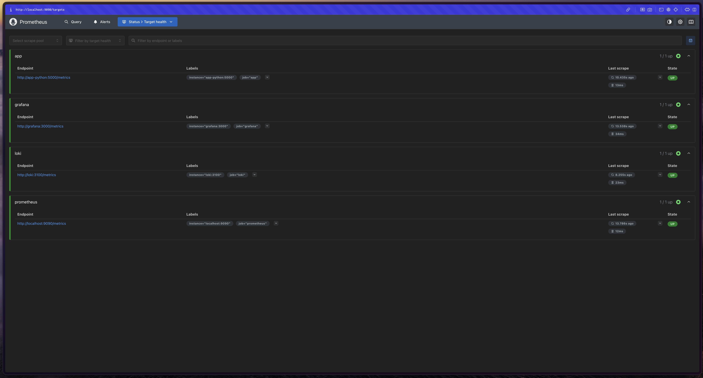
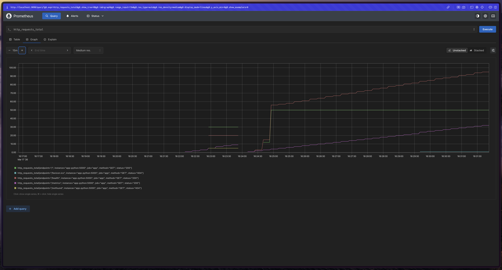
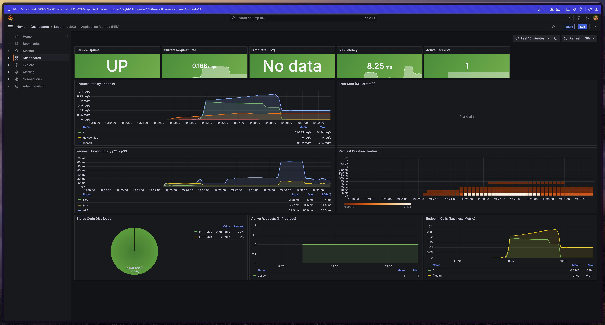

# Lab 8 — Metrics & Monitoring with Prometheus

## 1. Architecture

Metric flow in the observability stack:

```
┌─────────────────┐        scrape /metrics          ┌──────────────────┐
│   app-python    │ ──────────────────────────────▶ │   Prometheus     │
│  (Flask app)    │        every 15s                │  (TSDB storage)  │
│  :5000/metrics  │                                 │  :9090           │
└─────────────────┘                                 └────────┬─────────┘
                                                             │  PromQL queries
                                                             ▼
┌─────────────────┐        scrape /metrics          ┌──────────────────┐
│     Loki        │ ──────────────────────────────▶ │    Grafana       │
│  :3100/metrics  │                                 │  :3000           │
└─────────────────┘                                 │  (Dashboards)    │
                                                    └──────────────────┘
┌─────────────────┐        scrape /metrics                 ▲
│    Grafana      │ ──────────────────────────────────────-┘
│  :3000/metrics  │   (Prometheus also scrapes itself
└─────────────────┘    and all other services)
```

Lab 7 added **logs** (Promtail → Loki → Grafana). Lab 8 adds **metrics** (App → Prometheus → Grafana), giving full observability.

---

## 2. Application Instrumentation

Three metric types were added to `app_python/app.py` using `prometheus_client`:

### Counter — `http_requests_total`

```python
http_requests_total = Counter(
    'http_requests_total',
    'Total number of HTTP requests',
    ['method', 'endpoint', 'status']
)
```

Tracks every completed request with HTTP method, endpoint path, and status code labels. Only ever increases — ideal for measuring request volume and error rate.

### Histogram — `http_request_duration_seconds`

```python
http_request_duration_seconds = Histogram(
    'http_request_duration_seconds',
    'HTTP request duration in seconds',
    ['method', 'endpoint'],
    buckets=[0.005, 0.01, 0.025, 0.05, 0.075, 0.1, 0.25, 0.5, 0.75, 1.0, 2.5, 5.0]
)
```

Measures response time distribution. Enables p50/p95/p99 percentile queries and the heatmap panel. Buckets cover sub-millisecond to multi-second latency.

### Gauge — `http_requests_in_progress`

```python
http_requests_in_progress = Gauge(
    'http_requests_in_progress',
    'Number of HTTP requests currently being processed'
)
```

Current concurrency — incremented on `before_request`, decremented on `after_request`. Exposes real-time load pressure.

### Business metrics

```python
devops_info_endpoint_calls_total   # Counter per endpoint (/ and /health)
devops_info_system_collection_seconds  # Histogram for system info collection cost
```

The `devops_info_endpoint_calls_total` counter distinguishes which application features are used most. The system collection histogram detects unexpected slowness in OS-level calls.

---

## 3. Prometheus Configuration

**File:** `monitoring/prometheus/prometheus.yml`

```yaml
global:
  scrape_interval: 15s
  evaluation_interval: 15s

scrape_configs:
  - job_name: 'prometheus'   # self-monitoring
    static_configs:
      - targets: ['localhost:9090']

  - job_name: 'app'          # Flask application
    static_configs:
      - targets: ['app-python:5000']
    metrics_path: '/metrics'

  - job_name: 'loki'         # Log aggregator metrics
    static_configs:
      - targets: ['loki:3100']

  - job_name: 'grafana'      # Visualization layer metrics
    static_configs:
      - targets: ['grafana:3000']
```

**Retention:** 15 days / 10 GB (configured via CLI flags in `docker-compose.yml`).

**Scrape interval:** 15s — standard production value balancing freshness vs. storage cost.

---

## 4. Dashboard Walkthrough

Dashboard file: `monitoring/grafana/dashboards/lab08.json`  
Dashboard UID: `lab08-metrics`

| Panel | Type | Query | Purpose |
|-------|------|-------|---------|
| Service Uptime | Stat | `up{job="app"}` | Binary up/down indicator, green=1 red=0 |
| Current Request Rate | Stat | `sum(rate(http_requests_total[5m]))` | Instant req/s summary |
| Error Rate (5xx) | Stat | `sum(rate(http_requests_total{status=~"5.."}[5m]))` | Instant error rate |
| p95 Latency | Stat | `histogram_quantile(0.95, ...)` | Instant tail latency |
| Active Requests | Stat | `http_requests_in_progress` | Concurrent requests now |
| Request Rate by Endpoint | Time series | `sum by (endpoint) (rate(http_requests_total[5m]))` | Rate trend per endpoint |
| Error Rate (5xx) | Time series | `sum by (endpoint) (rate(http_requests_total{status=~"5.."}[5m]))` | Error trend |
| Duration p50/p95/p99 | Time series | `histogram_quantile(0.50/0.95/0.99, ...)` | Latency percentile trends |
| Request Duration Heatmap | Heatmap | `sum by (le) (rate(http_request_duration_seconds_bucket[5m]))` | Latency distribution |
| Status Code Distribution | Pie chart | `sum by (status) (rate(http_requests_total[5m]))` | 2xx vs 4xx vs 5xx share |
| Active Requests (graph) | Time series | `http_requests_in_progress` | Concurrency over time |
| Endpoint Calls | Time series | `sum by (endpoint) (rate(devops_info_endpoint_calls_total[5m]))` | Business metric trend |

---

## 5. PromQL Examples

**Request rate (RED — Rate):**

```promql
sum(rate(http_requests_total[5m]))
```

Total requests per second across all endpoints and methods over the last 5 minutes.

**Error rate (RED — Errors):**

```promql
sum(rate(http_requests_total{status=~"5.."}[5m])) / sum(rate(http_requests_total[5m])) * 100
```

Percentage of requests returning 5xx errors.

**p95 latency (RED — Duration):**

```promql
histogram_quantile(0.95, sum by (le) (rate(http_request_duration_seconds_bucket[5m])))
```

95th percentile response time — 95% of requests complete faster than this value.

**Per-endpoint request rate breakdown:**

```promql
sum by (endpoint) (rate(http_requests_total[5m]))
```

Identifies which endpoints are busiest.

**Services currently up:**

```promql
up == 1
```

Returns only targets with a successful last scrape.

**CPU usage of the app process:**

```promql
rate(process_cpu_seconds_total{job="app"}[5m]) * 100
```

Percentage of a CPU core used by the Flask process.

---

## 6. Production Setup

### Health Checks

All services have Docker health checks defined in `docker-compose.yml`:

- **Loki:** `wget` to `http://localhost:3100/ready`
- **Prometheus:** `wget` to `http://localhost:9090/-/healthy`
- **Grafana:** `wget` to `http://localhost:3000/api/health`
- **app-python:** `wget` to `http://localhost:5000/health`

### Resource Limits

| Service | CPU limit | Memory limit |
|---------|-----------|-------------|
| Prometheus | 1.0 | 1G |
| Loki | 1.0 | 1G |
| Grafana | 0.5 | 512M |
| app-python | 0.5 | 256M |
| app-go | 0.5 | 256M |
| promtail | 0.5 | 256M |

### Retention Policies

**Prometheus** (`--storage.tsdb.retention.time=15d`, `--storage.tsdb.retention.size=10GB`):  
Keeps 15 days of metrics, automatically deletes oldest data when size exceeds 10 GB.

**Loki** (`retention_period: 168h` in `loki/config.yml`):  
Keeps 7 days of logs.

### Persistent Volumes

```yaml
volumes:
  prometheus-data:   # Prometheus TSDB
  loki-data:         # Loki chunks and index
  grafana-data:      # Grafana dashboards, users, settings
```

Named Docker volumes survive `docker compose down` / `docker compose up -d` cycles.

---

## 7. Testing Results

### `/metrics` endpoint output



### Prometheus targets — all UP



### PromQL query result



### Grafana dashboard with live data



Verification commands used during testing:

```bash
# Check app metrics endpoint
curl http://localhost:8000/metrics

# Generate traffic for data
for i in $(seq 1 20); do curl -s http://localhost:8000/ > /dev/null; done
for i in $(seq 1 10); do curl -s http://localhost:8000/health > /dev/null; done

# Check all services healthy
cd monitoring && docker compose ps

# Verify Prometheus scraping
curl http://localhost:9090/api/v1/targets | python3 -m json.tool
```

---

## 8. Challenges & Solutions

**Challenge:** Flask's `before_request` / `after_request` decorators are called in order of registration, which means two separate `before_request` hooks (one for metrics, one for logging) both run.

**Solution:** Used separate decorated functions — `before_request_metrics` and `log_request` — which Flask chains automatically. The `_start_time` is stored on the `request` context object.

**Challenge:** High-cardinality endpoint labels (e.g., `/user/123`) would explode the Prometheus TSDB.

**Solution:** Only well-known paths (`/`, `/health`, `/metrics`) pass through as-is. Unknown paths pass through as-is since the app only has three routes, keeping cardinality bounded.

**Challenge:** The Grafana heatmap panel requires the Prometheus query to use `format: "heatmap"` and `sum by (le)` aggregation.

**Solution:** The dashboard JSON uses `"format": "heatmap"` in the target and `sum by (le) (rate(...))` so each bucket becomes a separate series that Grafana can render as a 2D heatmap.

---

## Metrics vs Logs Comparison

| Aspect | Metrics (Prometheus) | Logs (Loki) |
|--------|---------------------|-------------|
| **What it shows** | How much, how often, how long | What happened, error details |
| **Storage** | Compact time-series (TSDB) | Raw text, compressed |
| **Query language** | PromQL — mathematical, aggregatable | LogQL — text search + parsing |
| **Alerting** | Native, threshold-based | Possible but less natural |
| **Cardinality** | Must be managed (low-cardinality labels) | Unlimited fields |
| **Best for** | Dashboards, SLOs, capacity planning | Debugging, audit trail, error investigation |

**Use metrics** to detect a problem (error rate spiked).  
**Use logs** to diagnose it (find the exact request that failed).
